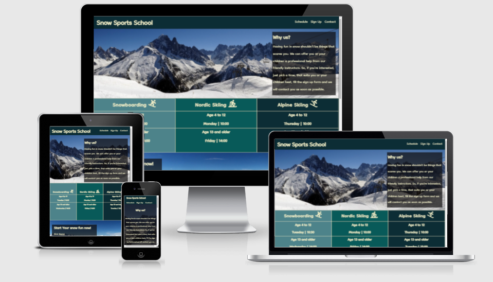
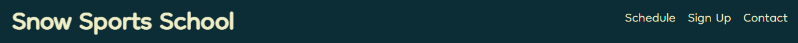
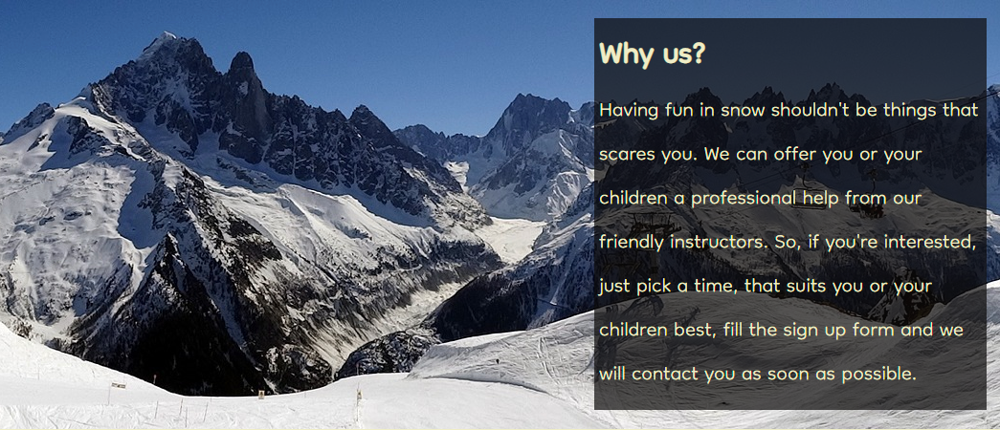
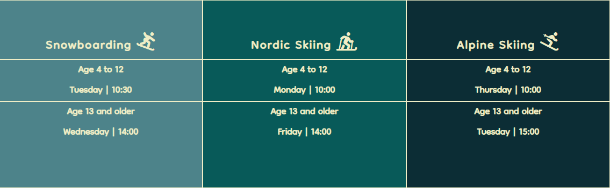
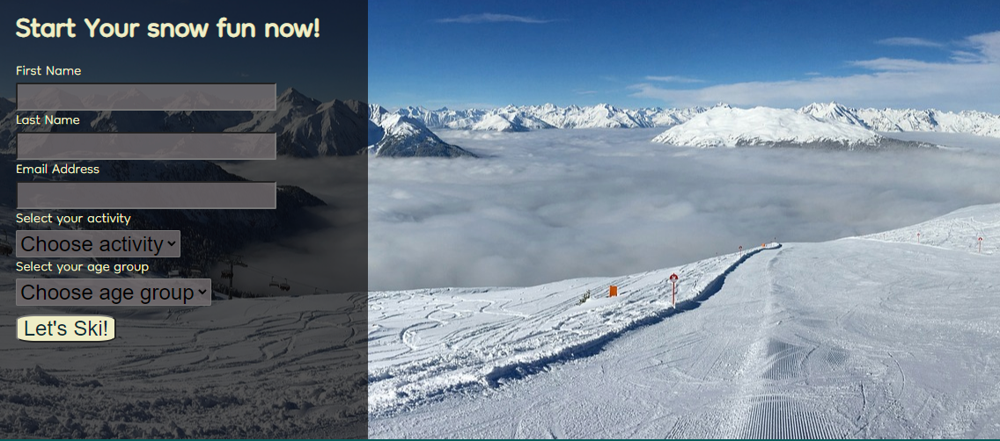
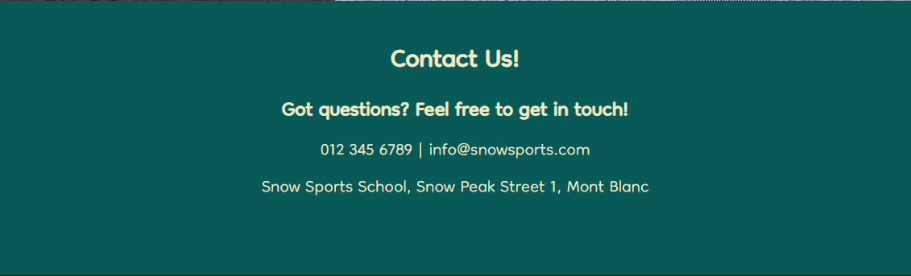
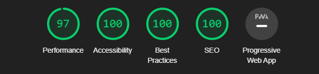

# Snow Sports School

The Snow Sports School website is created for those, who want to learn:
- Alpine skiing
- Nordic skiing
- Snowboarding

On this website, users can find information about school, meeting times, contact and form for sing up.

 

## Features

  ### Navigation

 - At the top left corner of the page, navigation bar shows name of the school
 - At the top right corner, stands navigation links. Those are: Schedule, Sign up and Contact.

  ### The Header

- Contains paragraph, that explains, why customer should use our service

  ### Schedule

- Contains information about meeting times for different activities, for different age groups

  ### The Sign Up form

- Contains Sign Up form, in which users supose to add there first name, last name, email and choose age group and activity

  ### Contact

- Contains our phone number, email address and address, so that the user can contact us in prefered way

  ### Footer

- Contains our links to social media pages

  ### Testing

- I tested that this webpage works in different browssers: Chrome, Firefox, Opera, Edge.
- I confirmed that this webpage is responsive and works on different screen sizes.
- I confirme that all element are readable and easy to understand.
- I have confirmed, that form work: al entrys are requared, email field accepts only emails and submition button works.

  ### Validator Testing

- HTML - No errors returned when passing through the official W3C validator
- CSS - No errors returned when passing through the official W3C (Jigsaw) validator
- Accessibility - i confirmed that the fonts and colors are easy to read and accessible by running it through lighthouse in devtools

  ### Deployment

- The site was deployed to GitHub pages
- [The live link can be found here](https://algirdas1993.github.io/snow-sports-school/)

## Credits

  ### Content

- Code for social media link and schedule section images was taken from [Font Awesome](https://fontawesome.com/)
- Used images was taken from [Pixabay](https://pixabay.com/)
